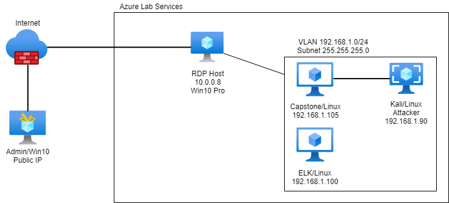

# Project2: Red vs. Blue
Assessment, Analysis, and Hardening of a Vulnerable System

## Attack / Defense / Monitoring / Mitigation

The files in this repository were produced by the network depicted below.

### Feature Presentation 

Access and download the main [Powerpoint](https://github.com/isejy07/Project2-Red-Blue/tree/main/Presentation/Proj2-RedVBlue.pptx) file for review.
